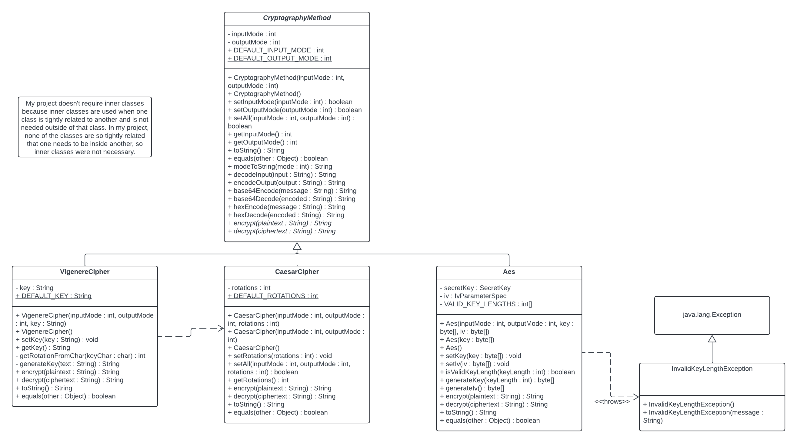
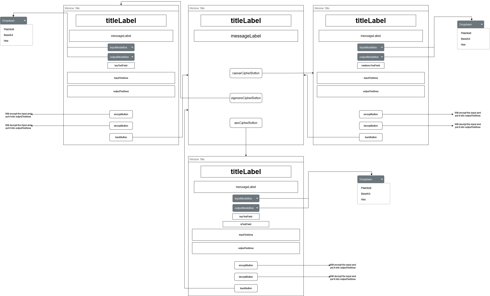
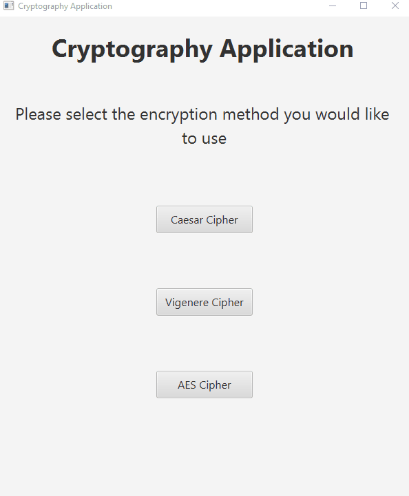

# Cryptography Application

## Description
This GUI application allows the user to choose from 3 different cryptographic algorithms: Caesar Cipher, Vigenere Cipher, and AES. Each algorithm provides very flexible input and output modes allowing for plaintext, base64, and hexadecimal encoded text (slight exception with AES).

## UML Diagram

## GUI Wireframe Diagram

## GIF of Working Project
